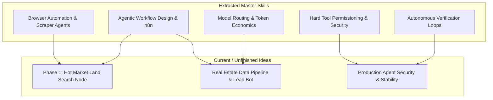

# 📚 Master Skills Catalog & Idea Connection Index

Welcome to your **Master Skills Catalog**. This system indexes all core skills extracted from your YouTube playlist, structures them as reusable agents/skills in `.agents/skills/`, and maps them directly to your current unfinished projects and future idea brainstorms.

---

## 🛠️ Extracted Skills & Customizations

Each skill below has been created as an active skill file in `.agents/skills/`:

| # | Skill Name | Focus Area | File Link |
| :-: | :--- | :--- | :--- |
| **1** | **Agentic Workflow Design & n8n** | Multi-node automation, triggers, sub-agent scheduling | [`SKILL.md`](file:///.agents/skills/agentic-workflow-design/SKILL.md) |
| **2** | **Context Engineering & Negative Prompting** | Hallucination prevention, `DONTS` registries, prompt versioning | [`SKILL.md`](file:///.agents/skills/context-engineering-negative-prompting/SKILL.md) |
| **3** | **Autonomous Verification Loops** | 60% → 95%+ completion loops, screenshot testing, quality gates | [`SKILL.md`](file:///.agents/skills/autonomous-verification-loops/SKILL.md) |
| **4** | **Model Routing & Token Economics** | 90% cost reduction, task-to-model routing (Haiku → Sonnet → Opus) | [`SKILL.md`](file:///.agents/skills/model-routing-token-economics/SKILL.md) |
| **5** | **Deterministic Evals & Golden Datasets** | Ground-truth benchmark datasets, LLM-as-a-Judge scoring | [`SKILL.md`](file:///.agents/skills/deterministic-evals-golden-datasets/SKILL.md) |
| **6** | **Pipe, Clog & Leak Constraint Mining** | Identifying business bottlenecks/leaks & North Star ROI framing | [`SKILL.md`](file:///.agents/skills/pipe-clog-leak-constraint-mining/SKILL.md) |
| **7** | **Hard Tool Permissioning & Security** | Scoped API keys (Draft-only), IAM restrictions, zero rogue actions | [`SKILL.md`](file:///.agents/skills/hard-tool-permissioning-security/SKILL.md) |
| **8** | **Browser Automation & Scraper Agents** | Headless Chrome/Playwright, DOM extraction, map viewport analysis | [`SKILL.md`](file:///.agents/skills/browser-automation-scraping-agents/SKILL.md) |

---

## 💡 Idea Connection Matrix

### 🎯 Connecting to Your Current & Unfinished Ideas

1. **Phase 1: Hot Market Land Search Webhook Node**:
   - **Applied Skill**: [`browser-automation-scraping-agents`](file:///.agents/skills/browser-automation-scraping-agents/SKILL.md) + [`agentic-workflow-design`](file:///.agents/skills/agentic-workflow-design/SKILL.md)
   - **Usage**: Automatically trigger headless browser nodes to search Zillow/Redfin 45–90 minutes outside growth cities, set filters to *Sold Land (30–90 days)*, analyze heat clusters, and count county parcel transactions.

2. **Automated Real Estate Lead Qualification & Pipeline**:
   - **Applied Skill**: [`model-routing-token-economics`](file:///.agents/skills/model-routing-token-economics/SKILL.md) + [`pipe-clog-leak-constraint-mining`](file:///.agents/skills/pipe-clog-leak-constraint-mining/SKILL.md)
   - **Usage**: Route raw parcel data extraction to cheap models (saving 90% API costs), using top-tier models only for final deal qualification and client proposal generation.

3. **Production Security & Rogue Action Prevention**:
   - **Applied Skill**: [`hard-tool-permissioning-security`](file:///.agents/skills/hard-tool-permissioning-security/SKILL.md) + [`context-engineering-negative-prompting`](file:///.agents/skills/context-engineering-negative-prompting/SKILL.md)
   - **Usage**: Lock down API keys so agents can draft SMS/emails or save deals to staging tables, but physically cannot execute unauthorized broadcasts or data deletion.

---

## ⚡ Future Idea Connection Engine (How We Connect New Ideas)

Whenever you share a **new idea** or **concept**, I will automatically scan this catalog and present:
1. **Relevant Skills**: Which of these 8 master skills power your new concept.
2. **Missing Ingredients**: What new skills or APIs need to be added to complete the build.
3. **Execution Blueprint**: How to combine these skills into a step-by-step implementation plan.

### 📺 Featured Courses & Masterclasses in Playlist

- **[Video IVx8OSMbTss](https://youtube.com/watch?v=IVx8OSMbTss)** (Index #1)
- **[Video 7WZ6XldxX0U](https://youtube.com/watch?v=7WZ6XldxX0U)** (Index #2)
- **[Video Ek1NBfnnTH0](https://youtube.com/watch?v=Ek1NBfnnTH0)** (Index #3)
- **[Video jdbOVepEtUE](https://youtube.com/watch?v=jdbOVepEtUE)** (Index #4)
- **[Video iTY8Q449YNQ](https://youtube.com/watch?v=iTY8Q449YNQ)** (Index #5)
- **[How to Use Claude Code Better Than 98% of People](https://youtube.com/watch?v=RzLV8sfFdMM)** (Index #6)
- **[Every Level of a Claude Second Brain Explained](https://youtube.com/watch?v=DTCyvo6cC54)** (Index #7)
- **[Video 3XIGcM7VICc](https://youtube.com/watch?v=3XIGcM7VICc)** (Index #8)
- **[Video NHFbAg2b54U](https://youtube.com/watch?v=NHFbAg2b54U)** (Index #9)
- **[Video iIfOprq2kCM](https://youtube.com/watch?v=iIfOprq2kCM)** (Index #10)
- **[Video ZRb7D6R64hM](https://youtube.com/watch?v=ZRb7D6R64hM)** (Index #11)
- **[Video gb5TlGw6Uks](https://youtube.com/watch?v=gb5TlGw6Uks)** (Index #12)
- **[Video 35WuZxbAY68](https://youtube.com/watch?v=35WuZxbAY68)** (Index #13)
- **[Video bCljOfCH8Ms](https://youtube.com/watch?v=bCljOfCH8Ms)** (Index #14)
- **[Claude Design 2 HOUR COURSE (Beginner to Pro)](https://youtube.com/watch?v=ovabeVoWrA0)** (Index #15)
- **[Video WX4rp-vP3zo](https://youtube.com/watch?v=WX4rp-vP3zo)** (Index #16)
- **[How to Never Hit Your Claude Session Limit Again](https://youtube.com/watch?v=_qZvORxGqI0)** (Index #17)
- **[100 Hours Testing Claude Code vs Antigravity (honest results)](https://youtube.com/watch?v=99VHENEKA9o)** (Index #18)
- **[Video eu8UJtuIi-E](https://youtube.com/watch?v=eu8UJtuIi-E)** (Index #19)
- **[Build & Sell with Claude Code (10+ Hour Course)](https://youtube.com/watch?v=mpALXah_PBg)** (Index #20)
- **[Video CBNbcbMs_Lc](https://youtube.com/watch?v=CBNbcbMs_Lc)** (Index #21)
- **[Video AO5aW01DKHo](https://youtube.com/watch?v=AO5aW01DKHo)** (Index #22)
- **[Master 95% of Claude Code in 36 Mins (as a beginner)](https://youtube.com/watch?v=saggDHHnmtQ)** (Index #23)
- **[Video 4OOS96i2gfI](https://youtube.com/watch?v=4OOS96i2gfI)** (Index #24)
- **[How I'd Learn n8n if I had to Start Over in 2026](https://youtube.com/watch?v=Fqeo8q8-nJg)** (Index #25)
- **[From Zero to Inbox Agent (Full Beginner's Course, No-Code)](https://youtube.com/watch?v=HN0oWxbF2bM)** (Index #26)
- **[Video Vm8QOo9MiC4](https://youtube.com/watch?v=Vm8QOo9MiC4)** (Index #27)
- **[I Tested OpenAI's AgentKit Against n8n: What You Need to Know](https://youtube.com/watch?v=XeIx4S6YvGo)** (Index #28)
- **[Video jBanaNBY-sM](https://youtube.com/watch?v=jBanaNBY-sM)** (Index #29)
- **[Video wq001sxDTWw](https://youtube.com/watch?v=wq001sxDTWw)** (Index #30)
- **[Beginner’s Guide to Metadata: Make Your RAG Agents Smarter](https://youtube.com/watch?v=lnm0PMi-4mE)** (Index #31)
- **[Video cCD303XsUjI](https://youtube.com/watch?v=cCD303XsUjI)** (Index #32)
- **[Local n8n AI Agents in 5 Minutes (FREE and no code)](https://youtube.com/watch?v=DcEMf2K6cPQ)** (Index #33)
- **[Video Ik8OHT3w4pE](https://youtube.com/watch?v=Ik8OHT3w4pE)** (Index #34)
- **[Build & Sell n8n AI Agents (8+ Hour Course, No Code)](https://youtube.com/watch?v=Ey18PDiaAYI)** (Index #35)
- **[I Built a 24/7 Viral Shorts Machine with No-Code (free n8n template)](https://youtube.com/watch?v=BcfjIBd49C8)** (Index #36)
- **[25 Hidden n8n Features That Save Hours of Work](https://youtube.com/watch?v=zMy5yoA-ub8)** (Index #37)
- **[APIs for AI Agents: The Only Beginner’s Guide You’ll Ever Need (n8n)](https://youtube.com/watch?v=qZkX_gIlwsY)** (Index #38)
- **[My Proven AI Agent Formula Explained](https://youtube.com/watch?v=Nj9yzBp14EM)** (Index #39)
- **[Build Anything with Lovable + n8n AI Agents (beginner's guide)](https://youtube.com/watch?v=kUpTUEwKnrk)** (Index #40)
- **[How MCPs Make Agents Smarter (for non-techies)](https://youtube.com/watch?v=m0YrxLnFPzQ)** (Index #41)
- **[Video BhGaGFH0jR4](https://youtube.com/watch?v=BhGaGFH0jR4)** (Index #42)
- **[6 Months of Building AI Agents in 43 Minutes (without the hype)](https://youtube.com/watch?v=QhujcQk8pyU)** (Index #43)
- **[Your AI Agent Prompts Are Wrong - Here's The Fix](https://youtube.com/watch?v=2vj2BF_dWeY)** (Index #44)
- **[The Ultimate n8n Starter Kit (2025) (Free)](https://youtube.com/watch?v=4JR-UrEZHQQ)** (Index #45)
- **[Everything I Learned About AI Agents in 2024 in 19 Minutes](https://youtube.com/watch?v=pYelCIqkm5Y)** (Index #46)
- **[AI Agent Prompting Masterclass: Beginner to Advanced](https://youtube.com/watch?v=bwrAsnU2P88)** (Index #47)
- **[n8n AI Agent Masterclass | AI Nodes Made Simple](https://youtube.com/watch?v=EzS2PIjyeQQ)** (Index #48)
- **[n8n Masterclass: Build AI Agents & Automate Workflows (Beginner to Pro)](https://youtube.com/watch?v=ZHH3sr234zY)** (Index #49)
