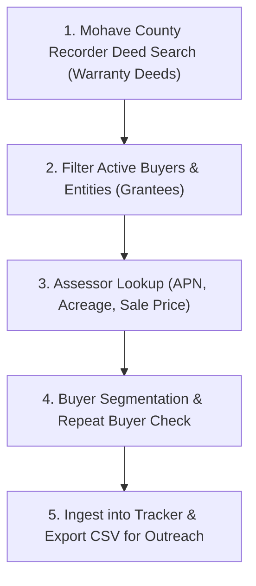

# 📖 SOP & Training Manual: Finding & Building Eager Land Buyer Lists

**Target Market**: Mohave County, AZ (Kingman, Golden Valley, Dolan Springs, Lake Havasu City, Bullhead City, Fort Mohave, Topock)  
**Objective**: Train a beginner or new team member to systematically find recent land buyers, isolate active repeat investors, segment buyer profiles, and build an outreach-ready lead list.

---

## 🧭 Overview & Core Strategy

When selling vacant land, the fastest way to assign deals or sell inventory is to bring them to **active, proven buyers** who are already buying land in the exact same area. 

Instead of guessing who might want to buy land, we let **public records (Warranty Deeds)** tell us exactly who is deploying cash right now.



---

## 🛠️ Required Tools & Portals

1. **Mohave County Recorder Search**: Used to search public warranty deeds by date.
2. **Mohave County Assessor Search**: Used to look up Parcel Numbers (APN), acreage, and property valuation.
3. **Mohave Land Buyer Tracker (Obsidian Vault & CSV)**: Used to log deals, auto-flag repeat buyers, and export CRM contact lists.

---

## 📋 Step-by-Step Execution Guide

### Step 1: Search for Recent Sales (Recorder's Office)
1. Open the Mohave County Recorder Document Search portal.
2. Set **Document Type** to **`Warranty Deed`** (or `Deed`).
   * *Note*: Do NOT use Quitclaim Deeds or Deeds of Trust for initial buyer tracking, as they often represent internal transfers or refinancing rather than true arm's-length cash sales.
3. Set **Recording Date Filter**: Set to the target window (e.g., April 1, 2026 – June 30, 2026).
4. Run search and open recent recorded deeds.

---

### Step 2: Extract Deed Information
For every warranty deed found, copy or record these **5 core deed fields**:

| Field Name | Description | Example |
| :--- | :--- | :--- |
| **Recording Date** | The exact date the deed was officially recorded | `04/23/2026` |
| **Grantee (BUYER)** | Person or LLC purchasing the property | `BEAR FRUIT PROPERTIES LLC` |
| **Grantor (SELLER)** | Previous owner selling the property | `HINSHAW MERRITT DONALD TRUST` |
| **Reception #** | Unique document recording number | `2026022218` |
| **Document Type** | Always verify it is `Warranty Deed` | `Warranty Deed` |

> [!IMPORTANT]
> **Beginner Mnemonic**: 
> - **GrantOR** = Original Owner (**Seller**)
> - **GrantEE** = Enters Ownership (**Buyer**)

---

### Step 3: Cross-Reference Assessor Data (Supporting Info)
Take the **Reception #** or **Grantee Name** into the Mohave County Assessor Search to pull parcel-level details:

1. **Parcel # (APN)**: Record Book-Map-Parcel format (e.g., `308-29-180`).
2. **Sub-Region / Area**: Identify nearest city/community:
   * *Kingman*, *Golden Valley*, *Dolan Springs*, *Lake Havasu City*, *Bullhead City*, *Fort Mohave*, *Topock*.
3. **Acreage**: Record total land size (e.g., `5.0 acres`).
4. **Sale Price / Consideration**: Pull price paid from deed or Affidavit of Property Value.
5. **Calculate Price per Acre**:
   $$\text{Price per Acre} = \frac{\text{Sale Price}}{\text{Acreage}}$$
   *(Example: $\$12,500 \div 5.0 \text{ acres} = \$2,500/\text{acre}$)*

---

### Step 4: Buyer Segmentation & Repeat Buyer Flagging

Classify every buyer into one of 5 **Buyer Personas**:

1. **Investor-Flipper**: LLCs or individuals buying multiple parcels under market value.
2. **Builder / Developer**: Commercial entities or homebuilders acquiring infill lots in town (Kingman / Lake Havasu).
3. **Off-Grid / Recreational**: Individuals buying 2.5–40 acre rural lots in Golden Valley or Dolan Springs.
4. **Retiree / Relocator**: Out-of-state buyers relocating to Arizona.
5. **Rancher / Agricultural**: Large acreage buyers (>40 acres).

> [!TIP]
> **Flagging Repeat Buyers (Hottest Leads)**:  
> If the same buyer name appears on **2 or more deeds** within your log, mark **`Repeat Buyer = YES`**. These are your #1 priority leads for direct outreach because they have active capital and proven intent to buy land right now.

---

### Step 5: Data Ingestion into the Tracker System

You can ingest data into your tracker system in 2 easy ways:

#### Option A: Copy-Paste Raw Snippet into Chat
Simply copy the text from the recorder search and paste it to your AI Assistant:
```text
2026022218 • Warranty Deed
Recording Date: 04/23/2026
Grantor: HINSHAW MERRITT DONALD TRUST
Grantee: BEAR FRUIT PROPERTIES LLC
```

#### Option B: Obsidian Drop Zone
Paste raw text into [`02_Raw_Data_Dump_Zone.md`](file:///C:/Users/Stack/Documents/Kada_Empire_Obsidian_Vault/Mohave_County_Land_Buyer_Tracker/02_Raw_Data_Dump_Zone.md) and run `python scratch/ingest_buyer_data.py`.

---

## 🚫 Common Beginner Mistakes to Avoid

1. **Confusing Grantor vs. Grantee**: Always verify Grantee is the Buyer before logging.
2. **Ignoring Multi-Parcel Deeds**: Sometimes a single deed covers 3 or 4 parcels under one price. Note "Multi-parcel deal" in the Notes field so $/acre calculations remain accurate.
3. **Missing Out-of-State Addresses**: Pay special attention to buyers with mailing addresses in California, Nevada, or Texas—they are often high-volume cash buyers.

---

## 📁 Related Obsidian Vault Files
- **Live Summary Dashboard**: [`00_Buyer_List_Summary_Dashboard.md`](file:///C:/Users/Stack/Documents/Kada_Empire_Obsidian_Vault/Mohave_County_Land_Buyer_Tracker/00_Buyer_List_Summary_Dashboard.md)
- **Master Transaction Log**: [`01_Eager_Land_Buyers_Master_Log.md`](file:///C:/Users/Stack/Documents/Kada_Empire_Obsidian_Vault/Mohave_County_Land_Buyer_Tracker/01_Eager_Land_Buyers_Master_Log.md)
- **Raw Data Drop Zone**: [`02_Raw_Data_Dump_Zone.md`](file:///C:/Users/Stack/Documents/Kada_Empire_Obsidian_Vault/Mohave_County_Land_Buyer_Tracker/02_Raw_Data_Dump_Zone.md)
- **SOP Training Manual (Vault Copy)**: [`03_Mohave_Land_Buyer_SOP_Training_Guide.md`](file:///C:/Users/Stack/Documents/Kada_Empire_Obsidian_Vault/Mohave_County_Land_Buyer_Tracker/03_Mohave_Land_Buyer_SOP_Training_Guide.md)
